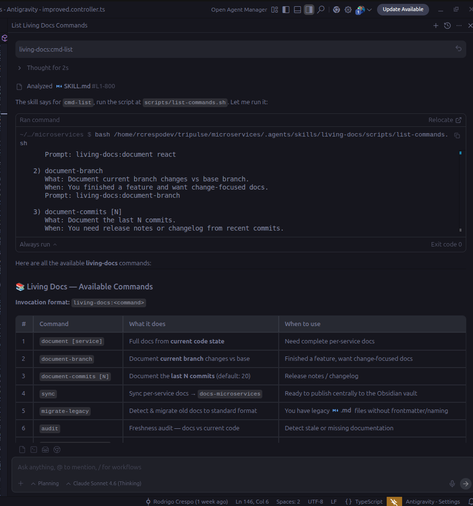
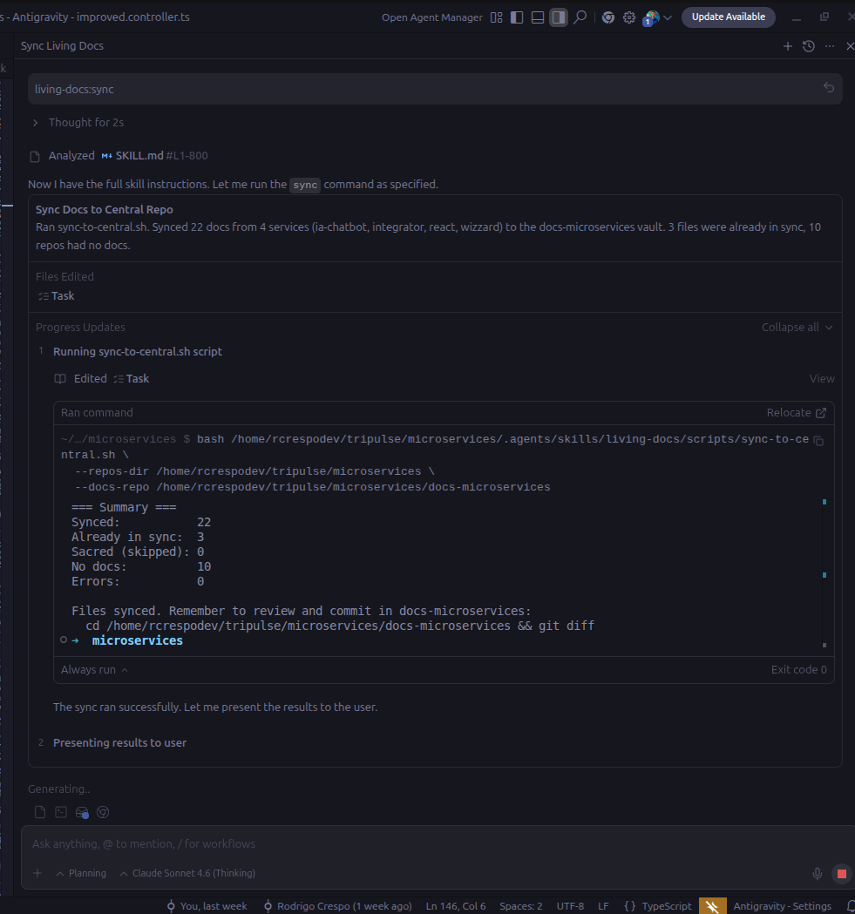
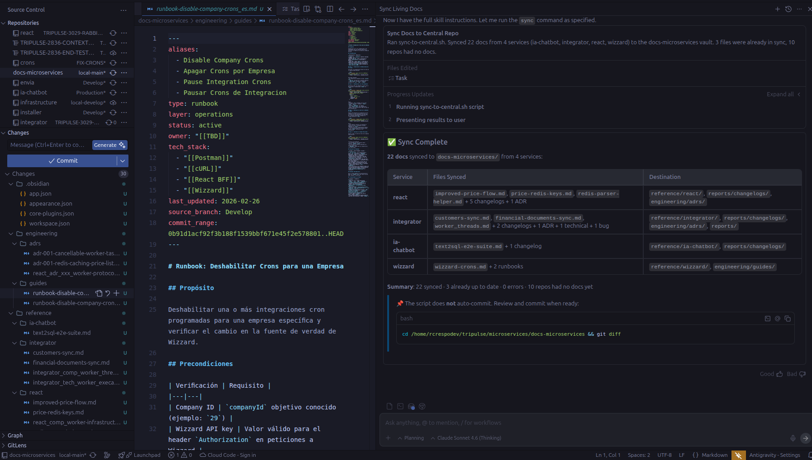
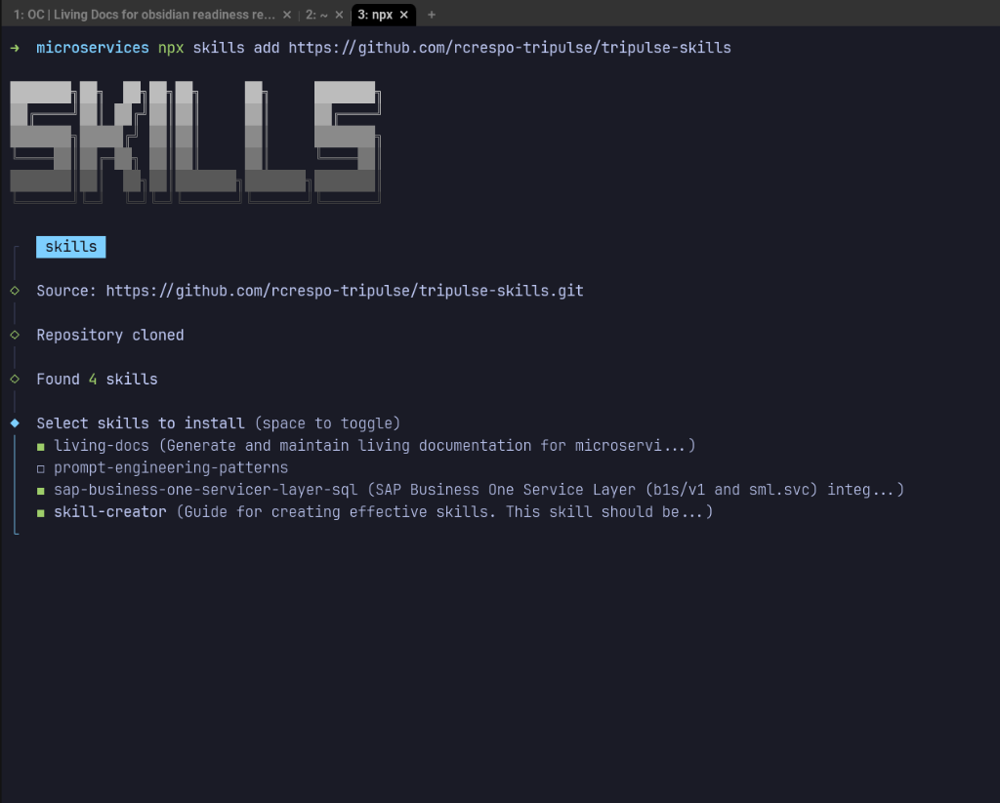
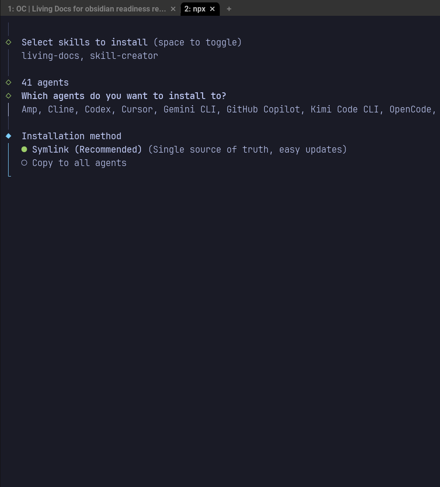
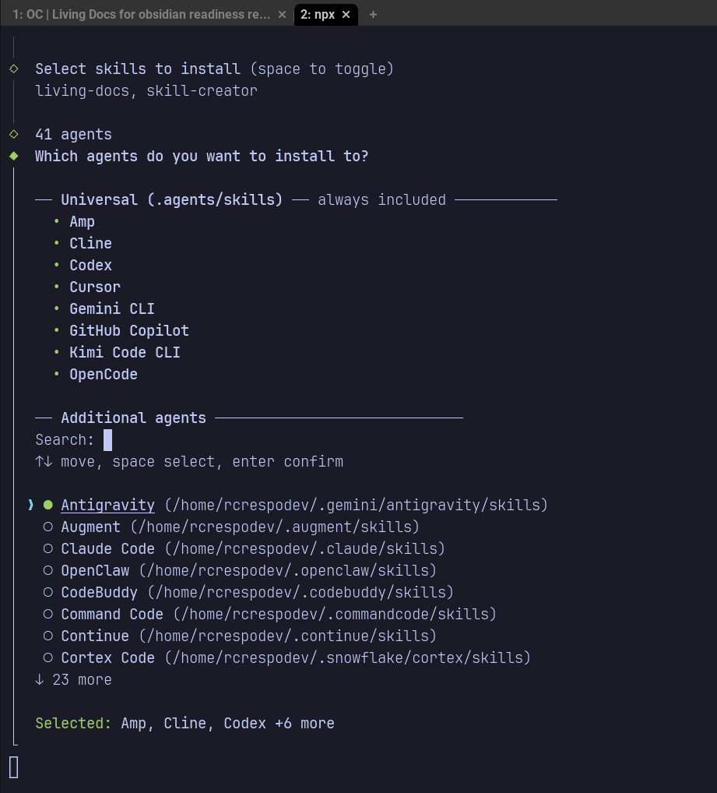
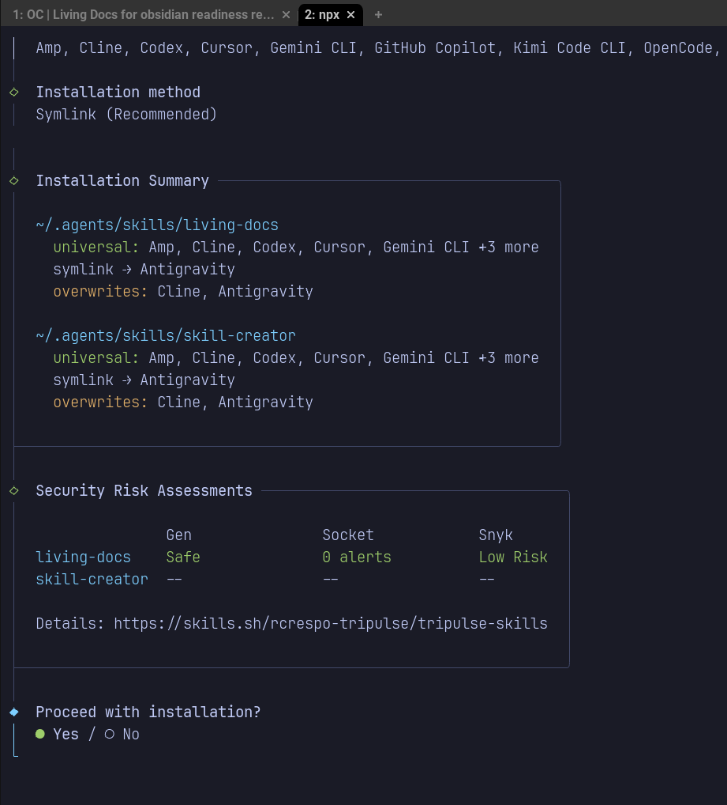
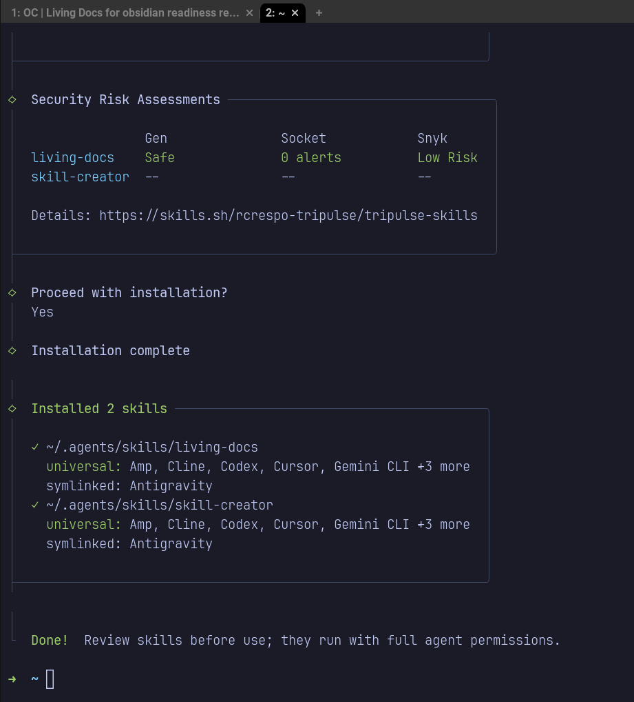
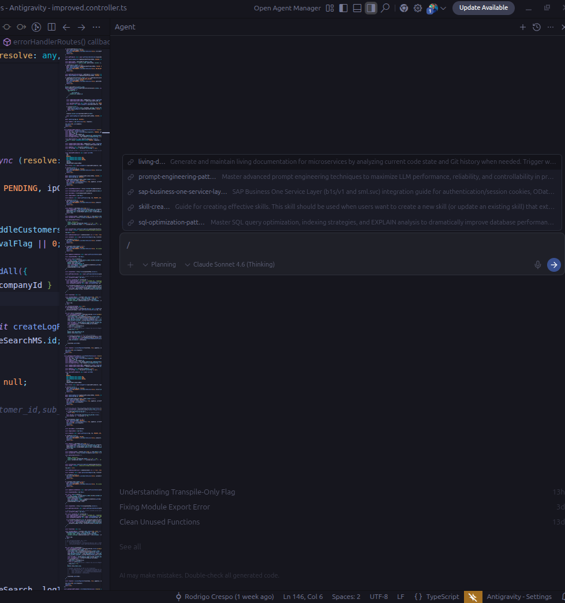
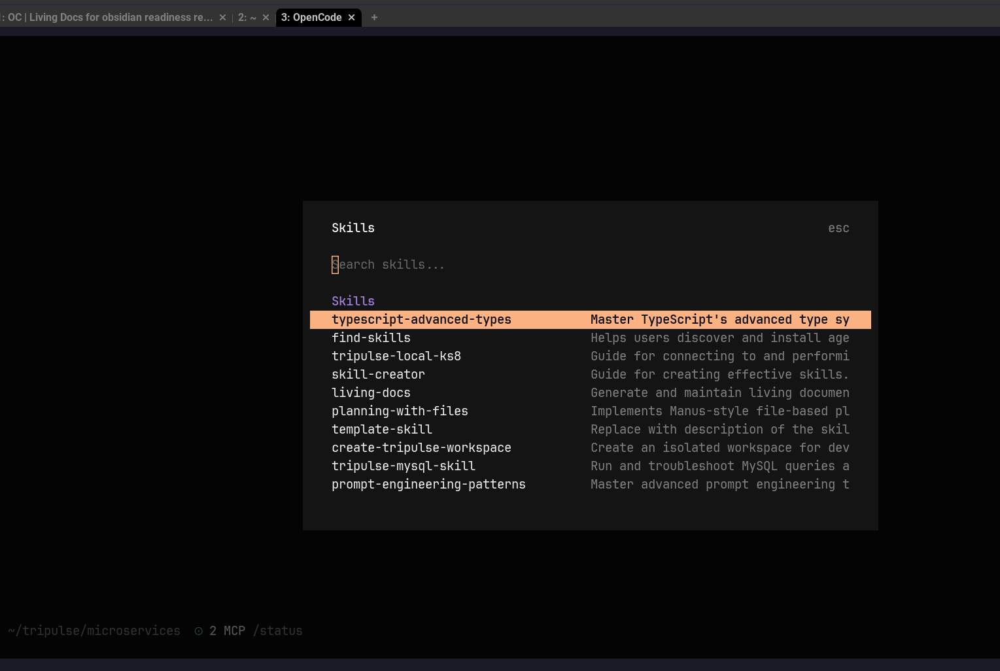

# tripulse-skills

Repositorio central de **skills para agentes de IA** de Tripulse. Aqui mantenemos skills utiles y personalizadas para todos los equipos de desarrollo. Cualquier agente de IA (Claude Code, Cursor, Codex, Copilot, Cline, etc.) que trabaje en un repositorio de Tripulse puede consumir estas skills para operar con las convenciones, flujos y herramientas del equipo.

Este README sirve tambien como guia tecnica general sobre skills: que son, como funcionan, como crearlas e instalarlas. Las primeras secciones priorizan la instalacion rapida de las skills disponibles en este repositorio.

## Indice

- [1) Skills disponibles e instalacion rapida](#1-skills-disponibles-e-instalacion-rapida)
- [2) Que son las Skills](#2-que-son-las-skills)
- [3) Como funcionan](#3-como-funcionan)
- [4) Compatibilidad multi-agente](#4-compatibilidad-multi-agente)
- [5) Casos de uso mas comunes](#5-casos-de-uso-mas-comunes)
- [6) Por que utilizar `skills.sh`](#6-por-que-utilizar-skillssh)
- [7) Como crear una skill propia (con skill-creator)](#7-como-crear-una-skill-propia-con-skill-creator)
- [8) Como instalar una skill](#8-como-instalar-una-skill)
- [9) Seguridad y gobernanza](#9-seguridad-y-gobernanza)
- [Referencias](#referencias)

## 1) Skills disponibles e instalacion rapida

Repositorio fuente:

```bash
npx skills add https://github.com/rcrespo-tripulse/tripulse-skills
```

Instalacion por skill especifica:

| Skill | Ubicacion | Descripcion | Comando de instalacion |
| ----- | --------- | ----------- | ---------------------- |
| [`living-docs`](./skills/living-docs/SKILL.md) | `skills/living-docs/` | Genera documentacion viva (changelogs, ADRs, runbooks) a partir de diffs de git | `npx skills add https://github.com/rcrespo-tripulse/tripulse-skills --skill living-docs` |
| [`skill-creator`](./skills/skill-creator/SKILL.md) | `skills/skill-creator/` | Meta-skill que guia la creacion de nuevas skills | `npx skills add https://github.com/rcrespo-tripulse/tripulse-skills --skill skill-creator` |
| [`prompt-engineering-patterns`](./.agents/skills/prompt-engineering-patterns/SKILL.md) | `.agents/skills/prompt-engineering-patterns/` | Patrones avanzados de prompt engineering para produccion | `npx skills add https://github.com/rcrespo-tripulse/tripulse-skills --skill prompt-engineering-patterns` |
| [`sap-business-one-servicer-layer-sql`](./skills/sap-business-one-servicer-layer-sql/SKILL.md) | `skills/sap-business-one-servicer-layer-sql/` | Guia de integracion con SAP Business One Service Layer: autenticacion, OData, QueryService, batch y configuracion | `npx skills add https://github.com/rcrespo-tripulse/tripulse-skills --skill sap-business-one-servicer-layer-sql` |
| [`typescript-advanced-types`](./skills/typescript-advanced-types/SKILL.md) | `skills/typescript-advanced-types/` | Dominio del sistema de tipos avanzado de TypeScript: generics, tipos condicionales, mapped types, template literals y utility types | `npx skills add https://github.com/rcrespo-tripulse/tripulse-skills --skill typescript-advanced-types` |
| [`planning-with-files`](./skills/planning-with-files/SKILL.md) | `skills/planning-with-files/` | Planificacion estilo Manus con archivos persistentes (`task_plan.md`, `findings.md`, `progress.md`) para tareas complejas de multiples pasos; soporta recuperacion de sesion automatica | `npx skills add https://github.com/rcrespo-tripulse/tripulse-skills --skill planning-with-files` |

### living-docs en accion

Listado de comandos disponibles de la skill `living-docs`:



Ejemplo de ejecucion del comando `sync` para sincronizar documentacion entre repositorios:





## 2) Que son las Skills

Las **skills** son capacidades reutilizables para agentes de IA. En la practica, son paquetes de conocimiento procedimental (instrucciones, flujos y convenciones) que un agente puede cargar para ejecutar tareas especializadas con mas consistencia.

Piensalas como:

- extensiones de comportamiento para el agente;
- playbooks operativos versionables en Git;
- bloques reutilizables para estandarizar como trabaja el equipo.

> Para ver un ejemplo real, explorar la skill [`living-docs`](./skills/living-docs/SKILL.md) incluida en este repositorio.

### Anatomia de una skill

Una skill es un **directorio** que contiene un archivo `SKILL.md` obligatorio y, opcionalmente, N archivos y sub-directorios adicionales:

```text
mi-skill/
├── SKILL.md              # (requerido) Index de la skill: frontmatter YAML + instrucciones
├── scripts/              # (opcional) Codigo ejecutable (.py, .sh, .js, etc.)
│   ├── init_skill.py
│   ├── package_skill.py
│   └── quick_validate.py
├── references/           # (opcional) Documentacion de apoyo (.md, .txt)
│   ├── output-patterns.md
│   └── workflows.md
└── assets/               # (opcional) Datos y templates (.json, .md, .yaml, etc.)
    └── examples.json
```

> El ejemplo de arriba corresponde a la estructura real de la skill [`skill-creator`](./skills/skill-creator/).

**`SKILL.md` es el index** — es el unico archivo que el agente lee siempre al cargar la skill. Contiene el frontmatter YAML (metadatos) y las instrucciones operativas principales. Desde ahi, el agente puede decidir cargar archivos adicionales de `references/`, ejecutar scripts de `scripts/`, o usar datos de `assets/` segun lo necesite.

Para que el agente sepa que esos recursos existen, **`SKILL.md` debe referenciarlos usando paths relativos**. El agente solo conoce lo que `SKILL.md` le dice — si un script o referencia no esta mencionado en el body, el agente no sabra que existe. Ejemplo real del `SKILL.md` de [`skill-creator`](./skills/skill-creator/SKILL.md):

```markdown
## Skill Creation Process

Skill creation involves these steps:

1. Understand the skill with concrete examples
2. Plan reusable skill contents (scripts, references, assets)
3. Initialize the skill (run init_skill.py)
4. Edit the skill (implement resources and write SKILL.md)
5. Package the skill (run package_skill.py)
6. Iterate based on real usage

Follow these steps in order, skipping only if there is a clear
reason why they are not applicable.
```

Notar como los pasos 3 y 5 referencian scripts por nombre (`init_skill.py`, `package_skill.py`). Mas adelante en el mismo `SKILL.md`, cada paso detalla el path relativo completo:

```markdown
### Step 3: Initializing the Skill
When creating a new skill from scratch, always run the `init_skill.py` script.
Usage:
    scripts/init_skill.py <skill-name> --path <output-directory>

### Step 5: Packaging a Skill
    scripts/package_skill.py <path/to/skill-folder>
```

Este patron — referenciar recursos con paths relativos desde `SKILL.md` — es lo que permite al agente navegar la skill como un arbol: lee el index, identifica que recursos necesita, y los carga bajo demanda.

Los archivos dentro de una skill pueden ser de **cualquier tipo**: `.md`, `.txt`, `.py`, `.sh`, `.json`, `.yaml`, `.js`, `.ts`, entre otros. No hay restriccion de formato porque **los agentes de IA viven en una terminal** — tienen acceso al shell del sistema operativo y pueden leer archivos, ejecutar scripts y correr comandos exactamente igual que un developer humano. Si un script `.sh` o `.py` esta en la skill, el agente puede ejecutarlo directamente.

## 3) Como funcionan

Una skill se define como un directorio con un archivo `SKILL.md` que incluye frontmatter YAML.

Ejemplo minimo:

```markdown
---
name: mi-skill
description: Cuando usarla y que resuelve
---

# Mi Skill

Instrucciones operativas para el agente.
```

Campos clave del frontmatter:

- `name` (requerido): identificador unico (minusculas, guiones).
- `description` (requerido): para que sirve y en que contexto se activa.
- `metadata.internal` (opcional): oculta la skill del descubrimiento normal.

### El campo `description`: el mecanismo de auto-invocacion

El campo `description` del frontmatter es **el campo mas importante de una skill** despues de las instrucciones mismas. Es el mecanismo principal por el cual los agentes deciden automaticamente si cargar una skill o no.

Cuando un agente recibe una tarea del usuario, compara el contexto de la conversacion contra las `description` de todas las skills disponibles. Si hay match semantico, el agente **carga la skill automaticamente** sin que el usuario lo pida. Por esto, la description debe ser rica en contexto: incluir que resuelve, cuando usarla, y palabras clave o frases que un usuario diria naturalmente.

Ejemplo de una description efectiva (de la skill [`skill-creator`](./skills/skill-creator/SKILL.md)):

```yaml
description: "Generate living documentation from git diffs — analyze branch
  comparisons or last N commits to automatically create or update Component Docs,
  Changelogs, ADRs, and Runbooks. Use when asked to: (1) document changes from
  a branch diff, (2) generate release notes, (3) update service documentation.
  Triggers: 'document the diff', 'generate docs from commits', 'release notes',
  'living docs', 'analiza el diff y genera documentacion'."
```

Notar como incluye:
- **Que hace** ("Generate living documentation from git diffs")
- **Cuando usarla** (lista numerada de escenarios)
- **Triggers textuales** (frases exactas que un usuario diria, incluso en otro idioma)

Una description pobre como `"Genera documentacion"` haria que el agente no la cargue cuando el usuario dice "necesito release notes del ultimo sprint" — porque no hay overlap semantico suficiente.

### Metodos de invocacion

Las skills se pueden invocar de tres formas:

#### 1. Auto-invocacion (recomendado)

El agente decide cargar la skill automaticamente basandose en el match entre la `description` y el contexto de la conversacion. Es el metodo mas natural — el usuario no necesita saber que la skill existe.

```
Usuario: "genera el changelog del ultimo sprint"
Agente:  (detecta match con la skill living-docs, la carga, y ejecuta el flujo)
```

#### 2. Invocacion manual por referencia

El usuario pide explicitamente al agente que use una skill por nombre o concepto. Util cuando el usuario sabe que la skill existe y quiere forzar su uso.

```
Usuario: "usa la skill living-docs para documentar los cambios de esta rama"
```

#### 3. Invocacion por herramienta (tool use)

Algunos agentes exponen las skills como herramientas invocables (tools). En ese caso, el agente puede llamar a la skill como si fuera una funcion. Esto depende de la implementacion del agente — por ejemplo, Claude Code expone un tool `mcp_skill` que permite cargar skills explicitamente.

### Flujo operativo simplificado

1. Instalamos skills en rutas compatibles con cada agente.
2. El agente descubre skills disponibles escaneando rutas estandar dentro del repositorio:
   - Raiz del repo (si contiene `SKILL.md`)
   - `skills/`
   - `.agents/skills/`, `.agent/skills/`
   - Rutas especificas de cada agente (`.claude/skills/`, `.cline/skills/`, etc.)
3. El agente decide usarla (auto-invocacion por `description`) o se le pide (invocacion manual/tool).
4. Carga las instrucciones de `SKILL.md` como contexto operativo.
5. Ejecuta el flujo definido, cargando `references/` y ejecutando `scripts/` segun lo necesite.

## 4) Compatibilidad multi-agente

### Por que existen `.agents/` y `.agent/`

Diferentes agentes buscan skills en diferentes rutas de proyecto. Por ejemplo:

| Directorio          | Agentes que lo usan                                                   |
| ------------------- | --------------------------------------------------------------------- |
| `.agents/skills/` | Codex, OpenCode, Cursor, Gemini CLI, GitHub Copilot, Amp, entre otros |
| `.agent/skills/`  | Antigravity                                                           |
| `.claude/skills/` | Claude Code                                                           |
| `.cline/skills/`  | Cline                                                                 |

La CLI `npx skills add` almacena una **unica copia** en `.agents/skills/` (u otra ruta canonica) y crea **symlinks** en las demas rutas que necesitan otros agentes. Asi se evita duplicar archivos y se mantiene una sola fuente de verdad.

`skills.sh` soporta mas de **40 agentes** de IA. Algunos de los mas relevantes:

| Agente         | Flag `--agent`   | Ruta de proyecto      | Ruta global                     |
| -------------- | ------------------ | --------------------- | ------------------------------- |
| Claude Code    | `claude-code`    | `.claude/skills/`   | `~/.claude/skills/`           |
| Codex          | `codex`          | `.agents/skills/`   | `~/.codex/skills/`            |
| OpenCode       | `opencode`       | `.agents/skills/`   | `~/.config/opencode/skills/`  |
| Cursor         | `cursor`         | `.agents/skills/`   | `~/.cursor/skills/`           |
| GitHub Copilot | `github-copilot` | `.agents/skills/`   | `~/.copilot/skills/`          |
| Gemini CLI     | `gemini-cli`     | `.agents/skills/`   | `~/.gemini/skills/`           |
| Cline          | `cline`          | `.cline/skills/`    | `~/.cline/skills/`            |
| Roo Code       | `roo`            | `.roo/skills/`      | `~/.roo/skills/`              |
| Windsurf       | `windsurf`       | `.windsurf/skills/` | `~/.codeium/windsurf/skills/` |
| Amp            | `amp`            | `.agents/skills/`   | `~/.config/agents/skills/`    |

> La tabla completa de agentes y rutas esta en la [documentacion oficial de skills.sh](https://github.com/vercel-labs/skills#supported-agents).

Al instalar, se puede apuntar a agentes especificos:

```bash
# Instalar para agentes concretos
npx skills add vercel-labs/agent-skills -a claude-code -a codex -a opencode

# Instalar para todos los agentes detectados
npx skills add vercel-labs/agent-skills --all
```

## 5) Casos de uso mas comunes

- **Estandarizacion de entregables**: PRs, changelogs, ADRs, runbooks.
- **Buenas practicas por stack**: React, Next.js, testing, observabilidad.
- **Integraciones**: patrones para APIs externas, CLIs internas o MCP.
- **Operaciones repetitivas**: release notes, auditorias, checklists de calidad.
- **Onboarding**: encapsular convenciones del equipo en una skill.

## 6) Por que utilizar `skills.sh`

`skills.sh` funciona como directorio y ecosistema abierto para descubrir skills y facilitar su adopcion.

Ventajas practicas:

- **Descubrimiento rapido** de skills existentes via [skills.sh](https://skills.sh).
- **Instalacion estandar** via CLI (`npx skills ...`).
- **Compatibilidad multi-agente** (40+ agentes) en un solo flujo.
- **Symlinks por defecto**: una sola copia canonica, multiples agentes enlazados.
- **Versionado y distribucion por Git** (facil de auditar).

## 7) Como crear una skill propia (con skill-creator)

La skill mas importante del ecosistema es **skill-creator**: una meta-skill que guia paso a paso la creacion de nuevas skills efectivas.

### Prerequisito: instalar skill-creator

Si `skill-creator` no esta disponible en el agente, instalarla:

```bash
npx skills add https://github.com/anthropics/skills --skill skill-creator
```

> La estructura de archivos de una skill se detalla en la seccion [2) Que son las Skills — Anatomia de una skill](#anatomia-de-una-skill).

### Paso a paso

#### Paso 1: Entender la skill con ejemplos concretos

Antes de escribir codigo, definir claramente los escenarios de uso:

- Que funcionalidad debe soportar la skill?
- Como la invocaria un usuario? Que diria para activarla?
- Que resultado espera?

Ejemplo: si se va a crear una skill `pdf-editor`, los escenarios podrian ser: "rotar este PDF", "extraer texto de este PDF", "combinar estos PDFs".

#### Paso 2: Planificar los recursos reutilizables

Analizar cada escenario e identificar que contenido conviene empaquetar:

| Tipo            | Cuando usarlo                                    | Ejemplo                   |
| --------------- | ------------------------------------------------ | ------------------------- |
| `scripts/`    | Codigo que se reescribiria cada vez              | `scripts/rotate_pdf.py` |
| `references/` | Documentacion/schemas para consultar en contexto | `references/schema.md`  |
| `assets/`     | Archivos de salida (templates, imagenes)         | `assets/boilerplate/`   |

#### Paso 3: Inicializar la skill

Usar el script de inicializacion que viene con skill-creator:

```bash
python .agents/skills/skill-creator/scripts/init_skill.py mi-skill --path ./skills
```

Esto genera la estructura de directorios con un `SKILL.md` template y directorios de ejemplo (`scripts/`, `references/`, `assets/`).

Alternativa con la CLI:

```bash
npx skills init mi-skill
```

#### Paso 4: Editar la skill

Completar `SKILL.md` con:

1. **Frontmatter**: `name` y `description` claros. La description es el mecanismo de trigger — incluir todos los contextos en los que debe activarse.
2. **Body**: instrucciones operativas en Markdown. Usar verbos imperativos, ser conciso, evitar duplicar lo que el modelo ya sabe.

Principios clave:

- **Conciso**: el contexto es un recurso compartido. Solo incluir lo que el modelo no sabe.
- **Grados de libertad**: instrucciones rigidas para operaciones fragiles, flexibilidad para tareas con multiples enfoques validos.
- **Progressive disclosure**: mantener `SKILL.md` < 500 lineas. Mover contenido detallado a `references/`.

Implementar los recursos (`scripts/`, `references/`, `assets/`) identificados en el paso 2. Eliminar los archivos de ejemplo que no se necesiten.

#### Paso 5: Empaquetar y validar

```bash
python .agents/skills/skill-creator/scripts/package_skill.py ./skills/mi-skill
```

El script valida el frontmatter, la estructura y la calidad de la description. Si pasa, genera un archivo `.skill` distribuible.

#### Paso 6: Iterar

Usar la skill en tareas reales, identificar fricciones, y refinar. Las mejores skills se pulen con uso real.

## 8) Como instalar una skill

Instalacion basica:

```bash
npx skills add vercel-labs/agent-skills
```

Instalar skills especificas:

```bash
npx skills add vercel-labs/agent-skills --skill frontend-design --skill skill-creator
```

Instalar para agentes concretos:

```bash
npx skills add vercel-labs/agent-skills -a claude-code -a codex -a opencode
```

Instalacion global (disponible en todos los proyectos):

```bash
npx skills add vercel-labs/agent-skills -g
```

### Formatos de fuente soportados

```bash
# GitHub shorthand (owner/repo)
npx skills add vercel-labs/agent-skills

# URL completa de GitHub
npx skills add https://github.com/vercel-labs/agent-skills

# Path directo a una skill en un repo
npx skills add https://github.com/vercel-labs/agent-skills/tree/main/skills/web-design-guidelines

# Path local
npx skills add ./my-local-skills
```

### Metodos de instalacion

| Metodo                          | Descripcion                                                                          |
| ------------------------------- | ------------------------------------------------------------------------------------ |
| **Symlink** (por defecto) | Crea symlinks desde cada agente hacia una copia canonica. Una sola fuente de verdad. |
| **Copy** (`--copy`)     | Crea copias independientes. Usar cuando symlinks no estan soportados.                |

### Donde instalar skills en una arquitectura de microservicios

En muchos equipos, los developers trabajan desde una **carpeta raiz local** que contiene multiples microservicios (cada subcarpeta con su propio repo Git). En ese escenario, para no reinstalar la misma skill en cada repo, hay dos scopes recomendados:

| Escenario | Scope recomendado | Por que |
| --------- | ----------------- | ------- |
| Skill compartida para trabajar toda la flota desde el root local (`microservices/`) | **Project** en el root local | Una sola instalacion visible para el agente cuando se ejecuta en esa raiz; evita duplicar instalacion en cada microservicio |
| Skill personal reusable en muchos proyectos | **Global** (`-g`) | Evita reinstalar en distintos workspaces y no toca estructura local del proyecto |

Recomendaciones practicas (alineadas con `skills.sh` + Agent Skills spec):

- Si el flujo diario se hace desde el root de microservicios, instalar en ese root (`npx skills add ...`) para compartir una sola capa local entre repos.
- Usar **`-g`** cuando el developer quiera disponibilidad en todos sus proyectos, sin depender del root local.
- Preferir **symlinks** (metodo por defecto) para mantener una sola copia canonica y facilitar updates.
- Verificar siempre la **visibilidad real del agente**: la skill debe existir en una ruta que ese agente escanee (`.agents/skills/`, `.claude/skills/`, `.cline/skills/`, etc.) y el agente debe ejecutarse desde ese workspace.

Ejemplo para un fleet local con `crons/`, `react/`, `sap/`, `integrator/`, etc.:

```bash
# Recomendado: instalar una sola vez en la raiz local de microservicios
cd microservices
npx skills add https://github.com/rcrespo-tripulse/tripulse-skills

# Opcional: disponibilidad global personal en todos tus proyectos
npx skills add https://github.com/rcrespo-tripulse/tripulse-skills -g
```



Durante la instalacion interactiva, la CLI permite seleccionar los agentes destino y las skills a instalar:









Resultado esperado en local (ejemplo):

```text
microservices/
├── .agents/skills/
├── .claude/
├── crons/
├── react/
├── sap/
├── integrator/
└── ...
```

### Comandos utiles de operacion

```bash
npx skills list              # Listar skills instaladas
npx skills find [query]      # Buscar skills por keyword
npx skills check             # Verificar actualizaciones disponibles
npx skills update            # Actualizar skills a ultima version
npx skills remove [skills]   # Eliminar skills instaladas
npx skills init [name]       # Crear template de SKILL.md
```

Ejemplos de como las skills instaladas son visibles directamente en el IDE para distintos agentes:





## 9) Seguridad y gobernanza

- Revisar `SKILL.md` antes de instalar skills de terceros.
- Preferir repositorios confiables/verificados.
- Definir una allowlist de skills aprobadas internamente.
- Tratar skills como codigo: PR, code review y versionado.

### Scope de instalacion

| Scope             | Flag      | Ubicacion             | Caso de uso                                    |
| ----------------- | --------- | --------------------- | ---------------------------------------------- |
| **Project** | (default) | `./<agent>/skills/` | Compartir con el equipo via repo               |
| **Global**  | `-g`    | `~/<agent>/skills/` | Preferencias personales en multiples proyectos |

## Referencias

- [skills.sh](https://skills.sh/) — Directorio y ecosistema de skills
- [skills.sh docs](https://skills.sh/docs) — Documentacion oficial
- [skills.sh CLI docs](https://skills.sh/docs/cli) — Referencia de la CLI
- [vercel-labs/skills](https://github.com/vercel-labs/skills) — Repositorio de la CLI (incluye tabla completa de agentes)
- [Agent Skills Specification](https://agentskills.io) — Especificacion compartida entre agentes
- [Skill Discovery paths (vercel-labs/skills)](https://github.com/vercel-labs/skills?tab=readme-ov-file#skill-discovery) — Rutas estandar que los agentes escanean para encontrar `SKILL.md`
