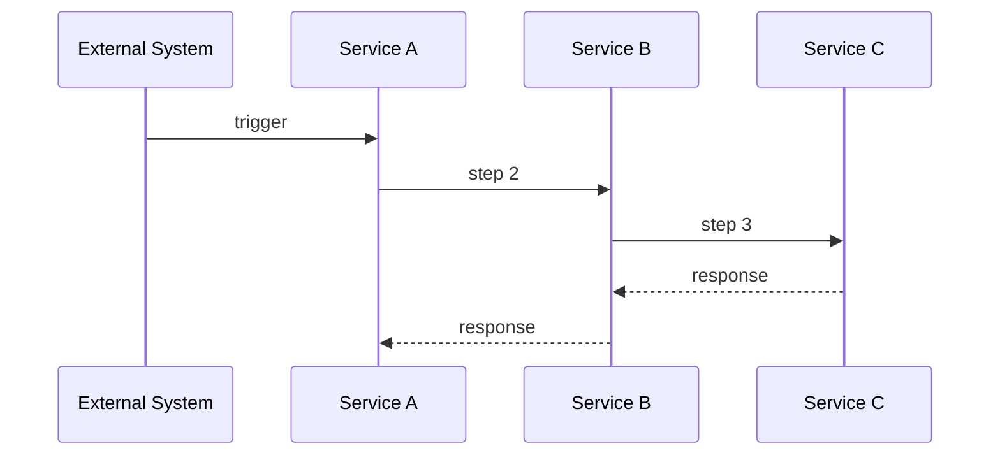

# {flow-name}

> One-paragraph summary: what this flow does end-to-end, when it triggers, and what the business outcome is.

## Context

### When does this flow execute?
What triggers it? (incoming webhook, scheduled job, user action, message on queue)

### Why does this flow exist?
What business need does it serve?

### Pre-conditions
What must be true before this flow can execute successfully?

## Flow Diagram

## Step-by-Step

### Step 1: {step-name}
- **Service**: {service-name}
- **Code**: `{service-name}/src/path/to/file.ts:functionName`
- **Input**: What data arrives and in what shape
- **Processing**: What happens to the data
- **Output**: What is produced / sent to the next step
- **Error handling**: What happens if this step fails
  - Retry? How many times? With what backoff?
  - Dead letter queue?
  - Alert/notification?

### Step 2: {step-name}
...

## Data Transformations

> Document how data changes shape as it moves through the flow. This is often the most confusing part for newcomers.

| Step | Input Shape | Output Shape | Key Transformations |
|------|------------|--------------|---------------------|
| 1->2 | Magento Order JSON | Internal OrderDTO | Field mapping, currency conversion |
| 2->3 | Internal OrderDTO | SAP Document Lines | Mapping to SAP business partner and item codes |

## Error Handling Summary

| Step | Error Type | Behavior | Recovery |
|------|-----------|----------|----------|
| 1 | Invalid payload | Reject + log | Manual review |
| 2 | SAP timeout | Retry 3x with backoff | Alert after 3 failures |

## Edge Cases & Known Issues

> Document non-obvious behaviors, race conditions, ordering dependencies, or known bugs.

- **Edge case**: {description}
  - **What happens**: {behavior}
  - **Workaround**: {if any}

## Related Documentation

- [{service-a} docs](../services/{service-a}/index.md)
- [{service-b} docs](../services/{service-b}/index.md)
- [ADR: {relevant-decision}](../decisions/{NNN}-{slug}.md)

## Changelog

### [{YYYY-MM-DD}] -- Initial documentation
- Flow traced and documented from code
- Services involved: {list}
