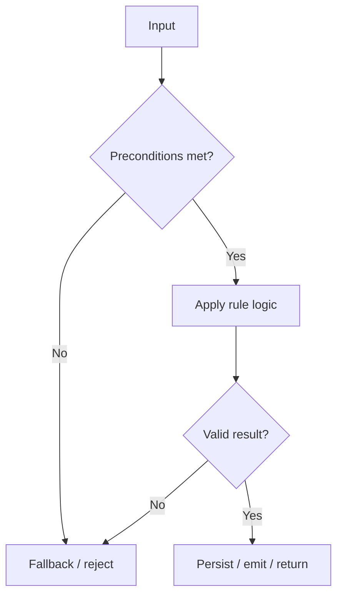

## Business Rules

| Rule ID | Description | Trigger | Outcome | Source |
|---|---|---|---|---|
| BR-001 | [Short rule description] | [When the rule runs] | [Expected outcome] | service/path/file.ext:L42 |

### Rule: BR-001 [Rule Name]
- **Intent**: Why this rule exists and which business objective it enforces.
- **Inputs**: Required and optional fields (example: `customerId`, `sku`, `quantity`, `currency`).
- **Preconditions**: Conditions that must be true before evaluation.
- **Decision logic**:
  1. [Step 1]
  2. [Step 2]
  3. [Step 3]
- **Validation / guards**: Invalid or missing data checks.
- **Failure behavior**: Fallback behavior and error/log strategy.
- **Side effects**: Events, writes, notifications, retries, external calls.
- **References**: `service/path/file.ext:functionName`, tests, config flags.



```ts
// Real snippet (10-40 lines max)
// file: service/path/file.ext:L42
export function applyRule(input: RuleInput): RuleOutput {
  // ...real logic excerpt...
}
```
