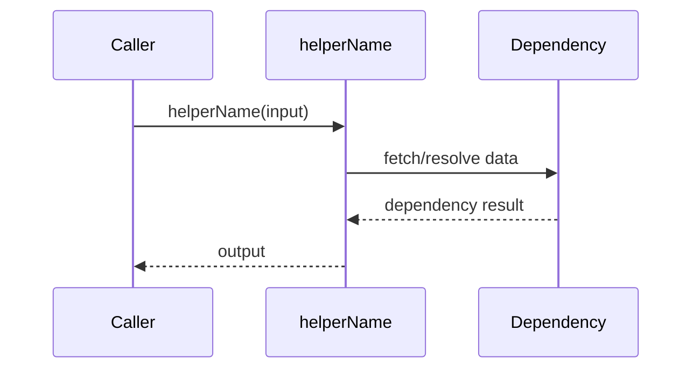

## Helpers & Utilities

| Helper | Purpose | Inputs | Output | Side Effects | Call Sites | Source |
|---|---|---|---|---|---|---|
| `helperName` | [What it computes/adapts] | [Input contract] | [Output contract] | [Any side effects] | [Main consumers] | service/path/file.ext:L42 |

### Helper: `helperName`
- **Role**: Pure computation, adapter, orchestrator, or guard.
- **Input contract**: Required/optional fields and constraints.
- **Output contract**: Return type and invariants.
- **Algorithm summary**: Short ordered steps.
- **Edge cases**: Null/empty, boundary values, precision, timezones, currency, encoding.
- **Consumers**: Services/modules that depend on this helper.
- **Change risk**: What may break if behavior changes.
- **References**: implementation + tests.



```ts
// Real snippet (10-40 lines max)
// file: service/path/file.ext:L42
export function helperName(input: Input): Output {
  // ...real logic excerpt...
}
```
