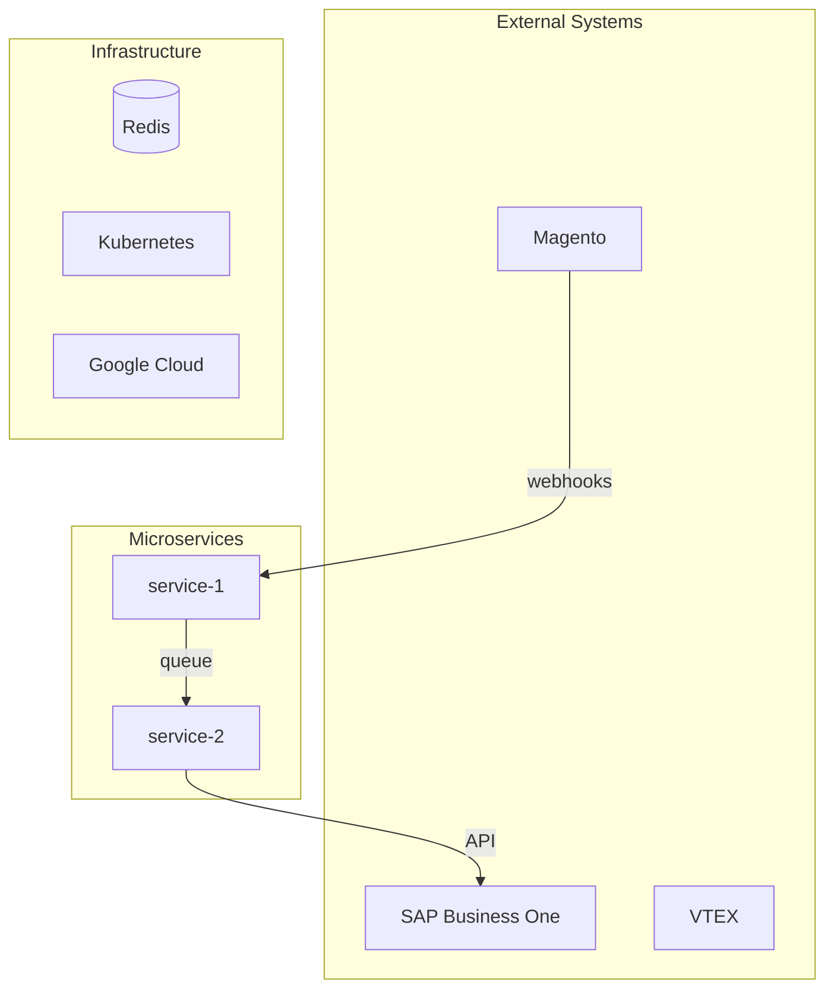

# System Overview

> One paragraph: what is this system, what business does it serve, and what is its core value proposition.

## Architecture Diagram

## Service Inventory

| Service | Purpose | Tech Stack | Integrations | Status |
|---------|---------|-----------|--------------|--------|
| integrator | Orchestrates data flow between platforms | NestJS, TS | Redis, SAP, Magento | Active |

## Communication Patterns

### Synchronous (HTTP)
| From | To | Purpose | Protocol |
|------|-----|---------|----------|

### Asynchronous (Queues / Events)
| Producer | Consumer | Queue/Topic | Message Type |
|----------|----------|-------------|-------------|

### Shared State
| Resource | Type | Used By | Purpose |
|----------|------|---------|---------|

## External System Integrations

### SAP Business One
- **Connection type**: Service Layer REST API
- **Services that connect**: {list}
- **Key operations**: {list}
- **Known limitations**: {list}

### Magento
- **Connection type**: REST API / Webhooks
- **Services that connect**: {list}
- **Key operations**: {list}

### VTEX
- **Connection type**: REST API
- **Services that connect**: {list}
- **Key operations**: {list}

## Shared Infrastructure

### Redis
- **Purpose**: Caching / Queuing / Session
- **Services that use it**: {list}
- **Key patterns**: pub/sub, sorted sets, etc.

### Kubernetes
- **Cluster**: {name/location}
- **Namespaces**: {list}
- **Key configurations**: resource limits, autoscaling, etc.

### Google Cloud
- **Services used**: {list: Cloud Run, Pub/Sub, Cloud Storage, etc.}

## Domain Glossary

> Define terms that mean specific things in this system. Essential for onboarding.

| Term | Definition | Context |
|------|-----------|---------|
| Order | A B2B purchase order from a client | Originates in Magento/VTEX, synced to SAP |
| Business Partner | SAP entity representing a client/supplier | SAP-specific term, mapped from Magento customer |
| Document Lines | SAP representation of order line items | Each line = one product in an order |

## Key Business Flows

> Quick reference to the flow documentation. For details, see the linked flow docs.

| Flow | Description | Services Involved | Doc |
|------|------------|-------------------|-----|
| Order B2B | End-to-end order processing | integrator, sap, magento | [Link](../flows/order-b2b-flow.md) |

## Changelog

### [{YYYY-MM-DD}] -- Initial documentation
- System overview generated from service scan
- {N} services documented
